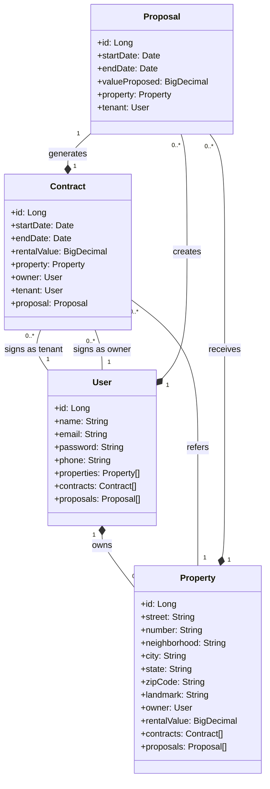

# Final Spring Boot Lab

## Introduction

This project is a simplified version of the "Quinto Andar" platform. It focuses on the rental module, providing endpoints and entities to create users, properties, proposals and contracts.

This is a successful use case on the platform:

- The owner signs up.
- The owner retrieves the property's address information by entering the zip code.
- The owner registers a property.
- The tenant signs up.
- The tenant browses available properties.
- The tenant submits a rental proposal.
- The owner creates a contract based on that proposal.

Both owners and tenants are users. In this simplified project, there is only one user role called "client," and the APIs are designed to serve this role.

## Business rules

### Users
- Passwords should be encrypted at rest
- For security reasons, the password stored should not be transmitted back to the client
- Ensure email uniqueness.
- Users can only update their own profiles.
- Users can only manage their own properties.
- Only authenticated users can create proposals and contracts.
- All user data is required.
- Only authenticated users can send requests to the Address API.

### Properties
- an available property is a property with no active rental contract
- a rented property is a property with an active contract
- a person should be able to list only available properties
- it is not possible to change the property ownership if the property is rented
- it is not possible to delete a rented property

### Proposals
- A property with an active contract cannot receive proposals.
- An owner cannot create a proposal for their own properties.
- Proposal duration must stand between 1 year and 30 months.
- Proposal start date cannot be in the past and cannot be the current date.
- Proposal start date must be before the end date.

### Contracts
- Owners must receive a proposal from a tenant to create a rental contract
- Prevent new contracts on rented properties.
- A contract is considered active if the end date is in the future.

Note: More business rules could be applicable in this scenario, but they were omitted to keep the project scope small.

## Project characteristics
- Spring Boot 3
- H2 Database (dev and test), Postgres (prd), JPA and JPQL queries
- Integration tests with JUnit and Mockito
- Spring Boot Security (JWT)
- Exception handling
- Spring Boot Validation
- Lombok
- OpenAPI documentation (Swagger)
- ViaCep integration through OpenFeign client
- Railway deploy configuration
- REST
- UML

## Testing the application

### JUnit tests

`Recomended`

You can read the test scripts and just run them. :)

### Manual tests

I have customized the OpenAPI installation to allow sending the authorization header.

http://localhost:8080/swagger-ui.html

To test the API, create two different users: one as the owner and 
the other as the tenant. Remember to switch users after creating 
a property, as you will not be able to create a proposal for your 
own property.

Important: Only owners can create a contract. 
Make sure you are logged in with the correct user.

## Endpoints

### Authorization

Expected format for Authorization header:

`Authorization: Bearer {USER_TOKEN}`

### User
- `POST /users` - Register a new user (public)
- `GET /users/{id}` - Retrieves a user (authenticated user, self only)
- `PUT /users/{id}` - Update user profile (authenticated users, self only)

### Authetication
- `POST /login` - Authenticate a user (public)

### Property
- `GET /properties/available` - Retrieve all properties with no active contract (public)
- `POST /properties` - Register a new property (authenticated users, self only)
- `DELETE /properties/{id}` - Delete a property (authenticated users, self only)
- `PUT /properties/{id}` - Update property details (authenticated users, self only)
- `GET /properties/{id}` - Retrieve a specific property (public)

### Proposal
- `POST /proposals` - Create a rental proposal for a property (authenticated users)

### Contract
- `POST /contracts` - Create a rental contract from a proposal (authenticated users, property owner only)

### Address
- `GET /address/{zipCode}` - Retrieve address details by ZIP code (authenticated users)

## Class Diagram

## Enunciado

Agora é a sua hora de brilhar e construir um perfil de destaque na DIO! Explore todos os conceitos explorados até aqui e replique (ou melhore, porque não?) este projeto prático. Para isso, crie seu próprio repositório e aumente ainda mais seu portfólio de projetos no GitHub, o qual pode fazer toda diferença em suas entrevistas técnicas 😎

Já dominamos o universo do desenvolvimento e construímos uma API REST utilizando o Java 17, a versão LTS mais recente repleta de novidades. Com o poder do Spring Boot 3, otimizamos nossa produtividade graças à sua habilidade de autoconfiguração. Além disso, facilitamos o acesso aos bancos de dados SQL com o auxílio do Spring Data JPA. Também destacamos a importância de uma documentação de API robusta e clara, utilizando o OpenAPI, ou Swagger. E com o Railway, simplificamos o Deploy de nossas soluções na nuvem. Agora, é hora de embarcar em um novo desafio e explorar um domínio de aplicação diferente, mantendo nosso foco em inovar e desenvolver soluções de alto padrão!

### Repositórios Git

O Git é um conceito essencial no mercado de trabalho atualmente, por isso sempre reforçamos sua importância em nossa metodologia educacional. Por isso, todo código-fonte desenvolvido durante este conteúdo foi versionado usando :

github.com/falvojr/santander-dev-week-2023: 
Repositório com todo o código-fonte desenvolvido neste Desafio de Projeto (Lab);

github.com/digitalinnovationone/santander-dev-week-2023-api: Aqui você tem acesso a uma versão mais robusta desta mesma API, com melhorias e padrões adicionais implementados. Se quiser se desafiar e buscar uma referência mais completa, este é o caminho!

Bons estudos 😉
